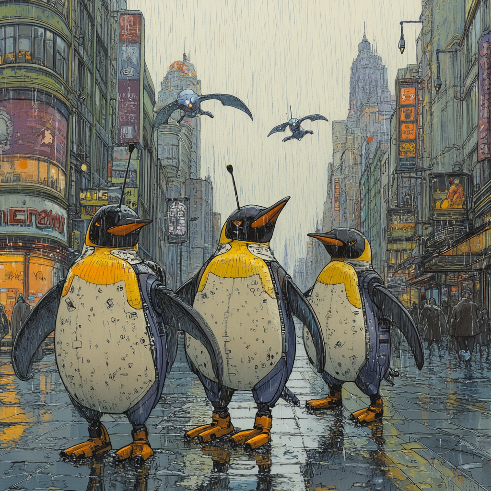

<!-- _backgroundColor: black -->
# Thanks!<!--fit-->
<!-- _color: gold -->

---
# Agenda
1. Talk about what was good, bad, and ugly.
2. Make some notes for next year for changes
3. Look through the student feedback
4. Add to the notes
5. Decide on food
   