<!-- _backgroundColor: black -->
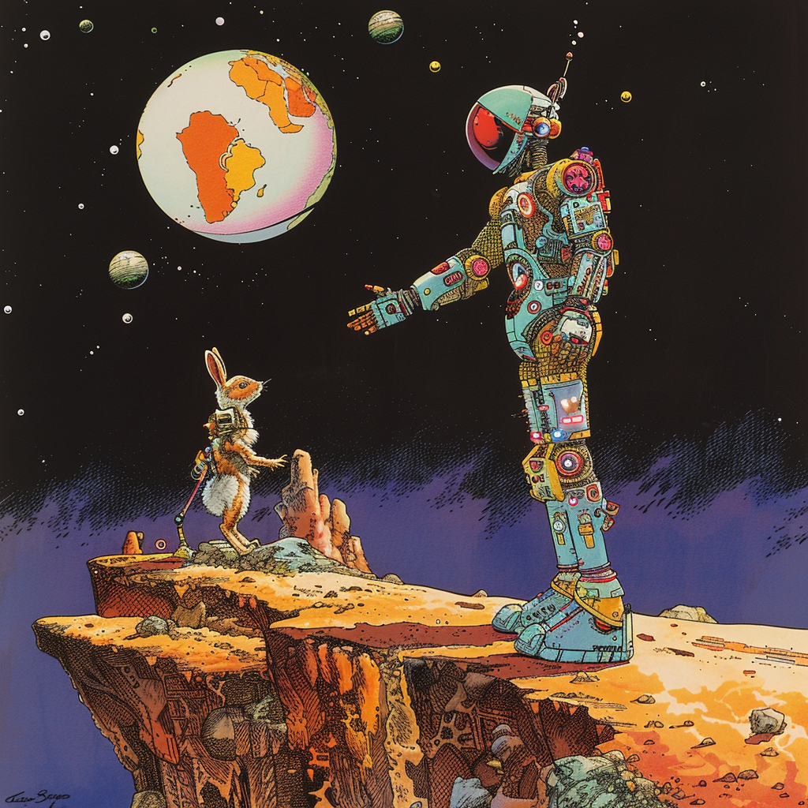
<!-- _color: white -->
# Hello World 

---

# Intro Kickstart-kursus i programmering 2024
Daniel Spikol 
*ds@di.ku.dk*

DIKU Københavns Universitet


---

# The Team
- Daniel Spikol
- Alexander Mittet
- Thea Nyks Meggele
- Jeppe Fræhr Møller
- Mathilde Kjer Parlo
- Andrea Sebro Rasmussen
- Casper Brahe Rützou 
- Viktoria Silke Sofia Strandbygaard
- Lucas Østergaard Jarmer

---

# Inclusive DIKU
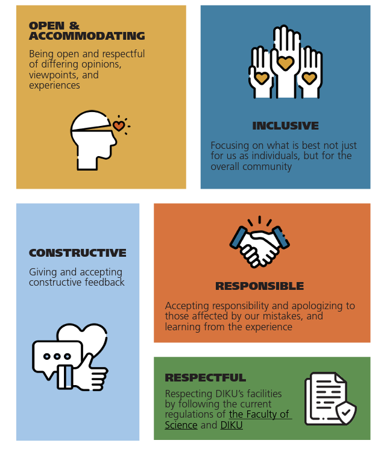
- Welcome to DIKU. Our goal is to promote excellence in computer science education and research.
- To strive for a respectful, inclusive, diverse environment and encourage open and critical academic discussion.
- We strive to create a welcoming and respectful environment.


---

# Velkommen!
- Presentation of Activities
- Why and what is the Kickstart course?

---

<style scoped>
  .top-title h1 {
    position: absolute;
    top: 0;
    width: 100%;
    text-align: center;
    font-size: 2em;
    margin: 0;
  }
</style>

<!-- Slide with a custom title style -->
<div class="top-title">

# Overal Plan for the week

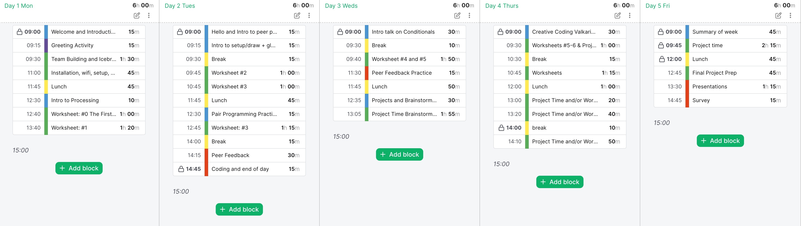
</div>

---

# Monday's Plan

- kl. 9:00-9:45 &rarr; Welcome and Introduction
- kl. 10:00-11:15 &rarr; Team Building Activities, Mini-Lecture, and Coding
- KL 11:15-12:00 &rarr; Processing Introduction
- kl. 12:00 - Lunch &rarr; Options (Bio Kantine...)
- kl. 13:00-13:30 &rarr; Aud.06 Intro to Processing
- kl. 13:30-15:00 &rarr; Team rooms - Intro to Processing
- kl. 14:45-15:00 &rarr; Check-in with your Teams
---

# Intended Fun Outcomes
- Why IFOs and not Intended Learning Outcomes
  - Intended Learning Outcomes (ILOs) define what a learner will have acquired and will be able to do upon completing their courses and studies.

---

# Intended Fun Outcomes
- Meet people and collaborate
- Explore programming with a focus on creating games
- Have fun and take chances through creativity
- Take control of your education


---

# Meet people and collaborate
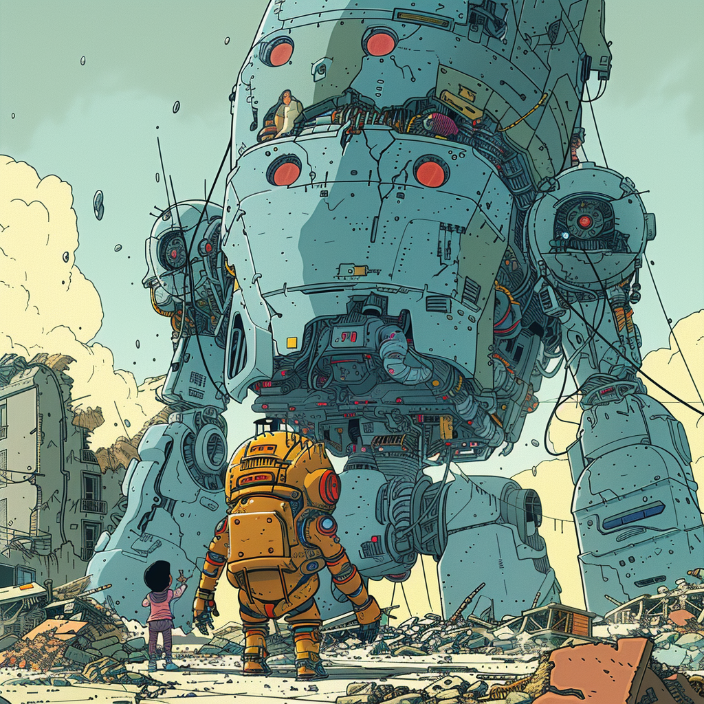
- Design Thinking
- Collaboration
- Reframing

---

# Teams and Instructors
- **Team Alpha:** Alexander and Thea &rarr; room 
- **Team Bravo:** Mathilde and Jeppe &rarr; room 
- **Team Charlie:** Casper and Andrea &rarr; room 
- **Team Delta:** Viktoria and Lucas &rarr; room 


---

# Challenge Time
- Design Thinking
- Collaboration
- Reframing

---
<style scoped>
  .top-title h1 {
    position: absolute;
    top: 0;
    width: 100%;
    text-align: center;
    font-size: 2em;
    margin: 0;
  }
</style>

<!-- Slide with a custom title style -->
<div class="top-title">

# HCØ Workrooms


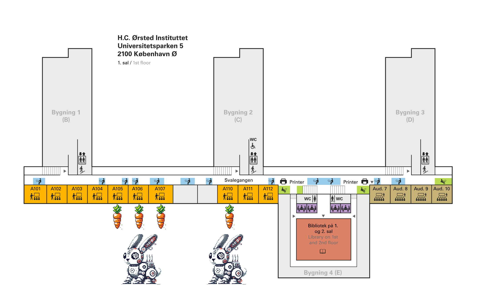
</div>

---
<style scoped>
  .top-title h1 {
    position: absolute;
    top: 0;
    width: 100%;
    text-align: center;
    font-size: 2em;
    margin: 0;
  }
</style>

<!-- Slide with a custom title style -->
<div class="top-title">

# Time for a Team Challenge

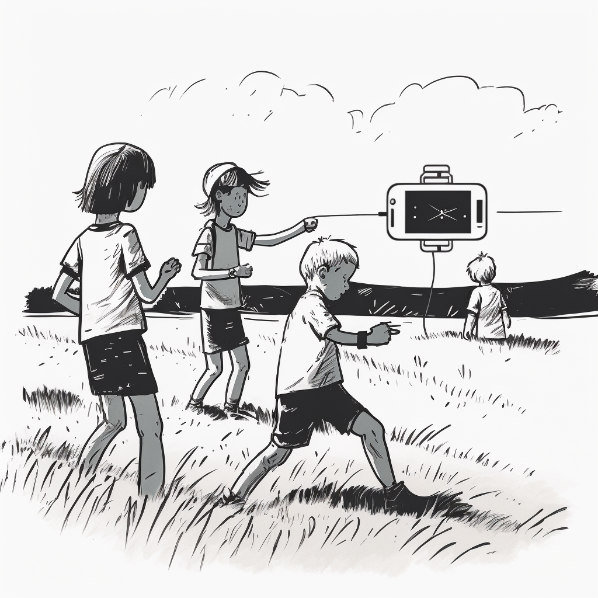
</div>

---

# Marshmallow Challenge Reflection 🍡
- [TED TALK Tom Wujec](https://www.ted.com/talks/tom_wujec_build_a_tower_build_a_team?utm_campaign=tedspread&utm_medium=referral&utm_source=tedcomshare)
- Constant prototyping as a problem-solving method.
- **Getting the Design Right and the Right Design** &rarr; Buxton, William (2007). *Sketching user experiences: getting the design right and the right design*. Amsterdam: Elsevier/Morgan Kaufmann

---

# Internet Access 📶
<span style="font-size:25px;">

#### Aktiver KU-bruger
- Log på [mit.ku.dk](http://mit.ku.dk) med NemID og find midlertidig pinkode. Gå til [kunet.dk](http://kunet.dk) og tryk "Første gang du logger på".
- Log på med den midlertidige kode og CPR nummer uden bindestreg.
- Aflæs KU brugernavn (fx abc123) og angiv password.
### Eduroam WiFi
- Kræver KU bruger og password
- Log på med brugernavn: abc123@ku.dk
#### Alternativt: KU Guest WiFi
- Opret 24 timers konto ved at indtaste navn, mail, mobilnummer.
- Modtag kode via SMS.

</div>

---

# Installation af p5*js
# https://p5js.org/
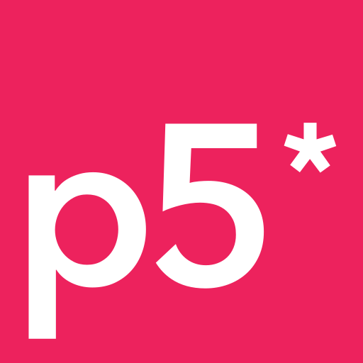

---
# Web Editor Steps

1. Access to the Internet 📶 and web browser 💻
2. The p5.js Web Editor is a website where programmers can write, test, share, or remix p5.js programs without needing to download or configure a code editor on a computer. A code editor makes writing and reading code easier by organizing and coloring text in a way that helps programmers see different parts of the code.
3. See this [Tutorial](https://p5js.org/tutorials/setting-up-your-environment/#web-editor) for getting up to speed if you want.

---
# P5 Sign up
1. You will want to save and share your files
2. You can sign-up with your Email, Google, or GitHub
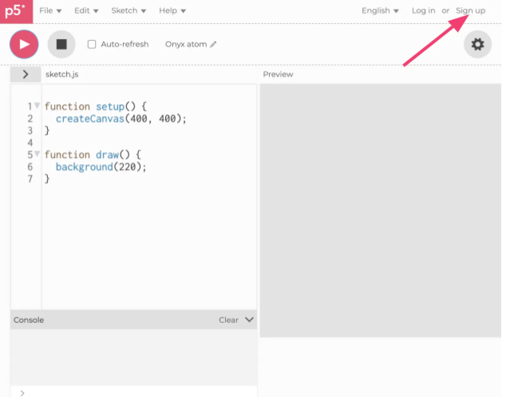

---
<style scoped>
  .top-title h1 {
    position: absolute;
    top: 0;
    width: 100%;
    text-align: center;
    font-size: 2em;
    margin: 0;
  }
</style>

<!-- Slide with a custom title style -->
<div class="top-title">

# p5.js Web Editor Interface

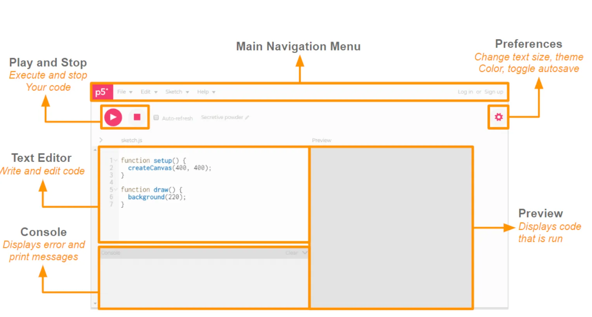

---
<!-- _color: yellow -->
# Lunch <!--fit-->

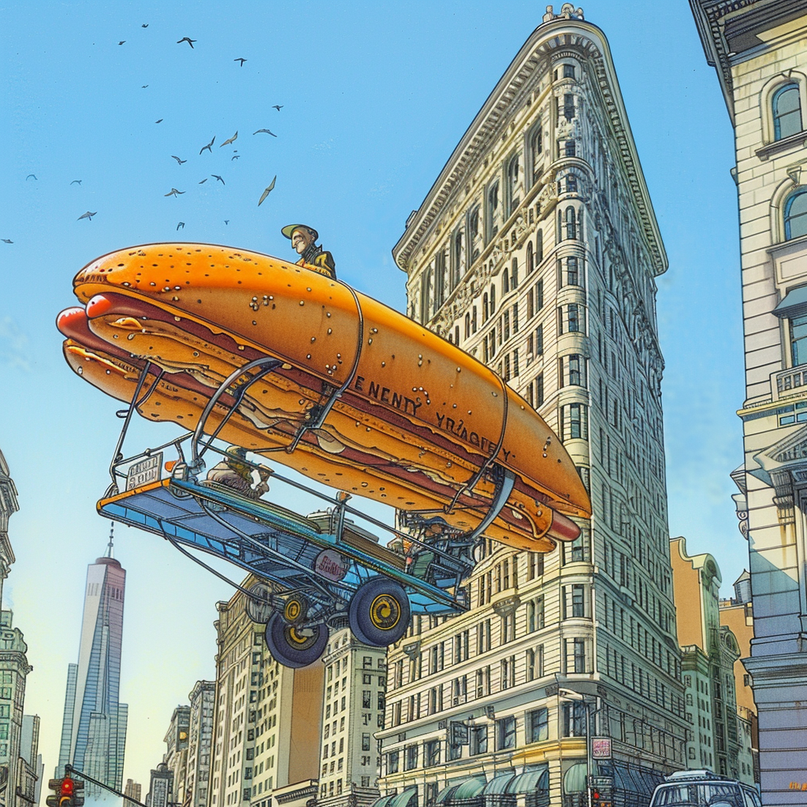

---

# Processing History
- M.I.T. Media Lab Casey Reas & Ben Fry
- Design By Numbers - Maeda, John. - Design by numbers / John Maeda.. - 1999. - ISBN: 0262133547
- Creative Programming

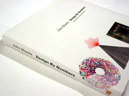

---

# What is Processing
- Processing is a flexible software sketchbook and a language for learning code. Since 2001, Processing has promoted software literacy within the visual arts and visual literacy within technology. Thousands of students, artists, designers, researchers, and hobbyists use Processing for learning and prototyping.
- Processing Development Environment ➔ PDE
- Programs are called Sketches
- The PDE consists of a simple text editor for writing code, a message area, a text console, tabs for managing files, a toolbar with buttons for common actions, and a series of menus.

---
<style scoped>
  .top-title h1 {
    position: absolute;
    top: 0;
    width: 100%;
    text-align: center;
    font-size: 2em;
    margin: 0;
  }
</style>

<!-- Slide with a custom title style -->
<div class="top-title">

# Processing Example

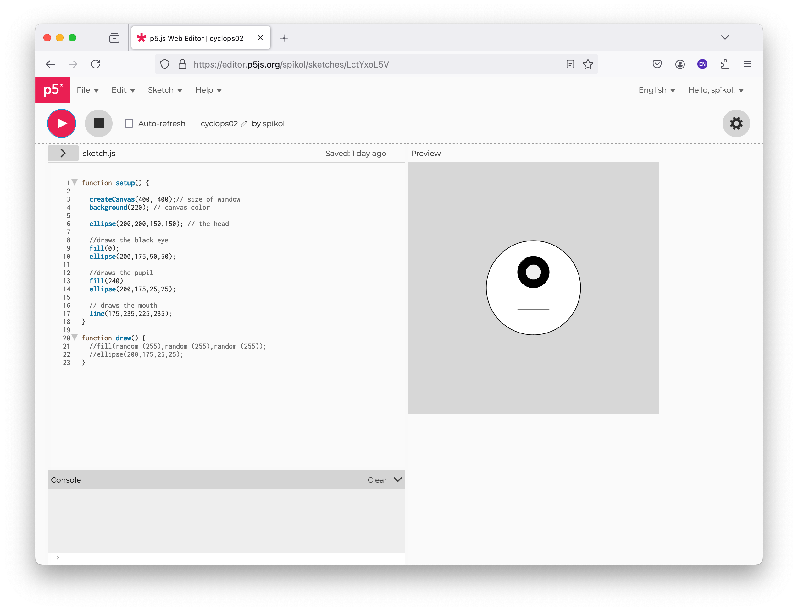

</div>

---

# Processing Parts 1
1. **Basics of Processing IDE:**
  - **Interface:** The Processing IDE has a simple interface. There's an area for writing code, buttons for running and stopping sketches, and a message area below for error messages and other notifications.
  - **Sketch:** In Processing, each project is called a "sketch". A sketch is a combination of code, data, and output.
2. **Language:** Processing uses a variant of the Java language. It's designed to be beginner-friendly, with simpler functions and setup to create visual and interactive projects quickly.

---

# Structure of a Basic Sketch:
  - **setup() function:** This is executed once when the sketch starts. It's commonly used to define initial environment properties such as screen size and background color.
  - **draw() function:** This runs repeatedly after setup(). It's used for continuously running code, such as animation or checking for input.
4. **Running the Sketch:** The sketch is compiled and run when you click the "Run" button (or press Ctrl+R/Cmd+R). The visual output is displayed in a separate window.

---

# Enough Lecture: Today's IFOs
- You will get a sense of the PDE shortly
- How to **draw and color** with Processing
- What are **Variables** as simple as they get

---

<style scoped>
  .top-title h1 {
    position: absolute;
    top: 0;
    width: 100%;
    text-align: center;
    font-size: 2em;
    margin: 0;
  }
</style>

<!-- Slide with a custom title style -->
<div class="top-title">

# Drawing in p5

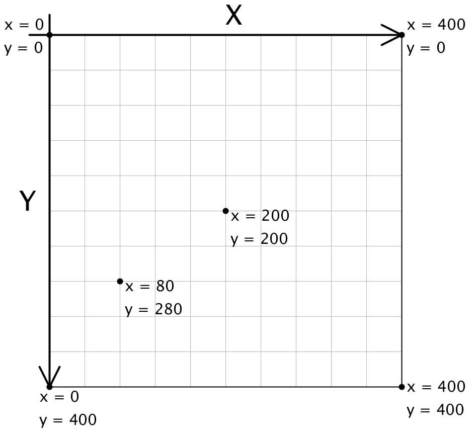
</div>

---
# Cartesian Coordinates in p5.js
**Canvas Grid:**
- Origin (0, 0) is at the top-left corner.
- X-axis increases to the right.
- Y-axis increases downward.
  
**Using Coordinates:**
- Position shapes using (x, y) coordinates.
  
**Example coordinates:**
- (0, 0) - Top-left corner.
- (400, 400) - Bottom-right corner (for a 400x400 canvas).

---

# Code Example

```JavaScript
function setup() {
  createCanvas(400, 400);
  ellipse(50, 50, 30, 30); // Top-left corner
  ellipse(350, 50, 30, 30); // Top-right corner
  ellipse(50, 350, 30, 30); // Bottom-left corner
  ellipse(350, 350, 30, 30); // Bottom-right corner
}

function draw(){
  
}
```

---

<style scoped>
  .top-title h1 {
    position: absolute;
    top: 0;
    width: 100%;
    text-align: center;
    font-size: 2em;
    margin: 0;
  }
</style>

<!-- Slide with a custom title style -->
<div class="top-title">

# Visual Example

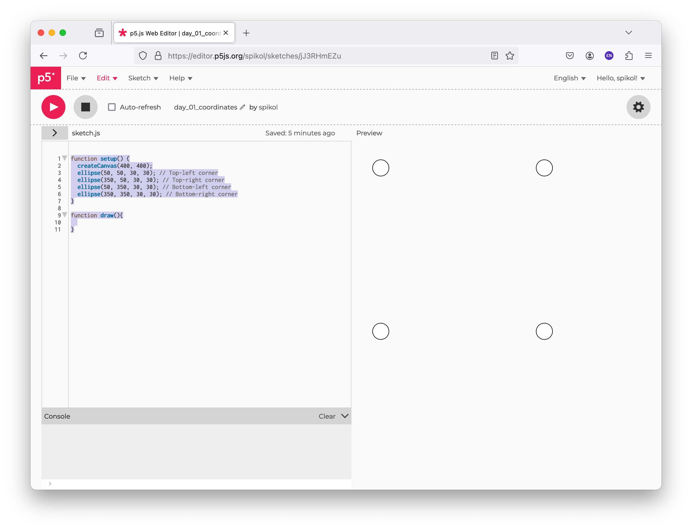

</div>

---

# Variables
- At its core, a **variable in programming** is like a container or a storage box that holds data.
- **Variables** are names that hold **values**.
- Imagine you have a box in real life where you put an apple; you might label that box "fruit" so you know it contains a fruit. In programming, the box is the variable, the apple is the data, and the label "fruit" is the variable's name.
- Keep in mind that, unlike real life, if you put an orange into your variable.

---
# Scoping Variables

- **Global Variables**:
  - Declared outside any function.
  - Accessible from any part of the program.
- **Local Scope
  - Variables declared within function or blocks

---
