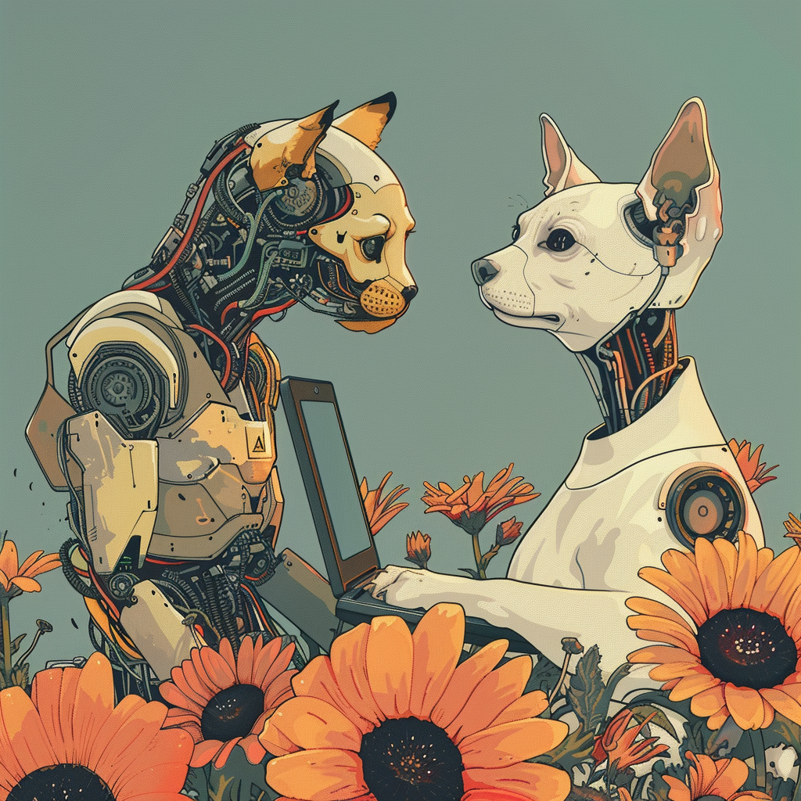

# Kickstart-kursus i programmering 24 dag 2
**Daniel Spikol**  
*ds@di.ku.dk*

**DIKU \\ Københavns Universitet**  
**15. august 2023**


---

# Recap from Yesterday
- Marshmallow Challenge - constant prototyping as a problem-solving method
- Coordinate System
- Drawing with Processing
- Variables
- Functions maybe...
- 
---

# Todays Plan - IFOs
- Let's dig into basic Python and Functions
- Making some Animations
- Exploring Pair Programming
- 
---

# What the heck is p5.js
- **User-Friendly and Inclusive**: p5.js is a free, open-source JavaScript library designed for learning to code and making art, welcoming artists, designers, beginners, and educators with a nurturing community.

- **Accessible and Intuitive**: Prioritizing accessibility, p5.js offers expansive documentation, visual examples, and a web editor for easy, intuitive coding, supporting audio-visual, interactive, and experimental web works.

- **Community and Creativity**: Emphasizing iterative coding for creative expression, p5.js values open source and community involvement, providing inspiration and support to learn, create, and share freely, with many community-created libraries available.

---

# Brief History of p5.js
- **Origin and Inspiration**: p5.js was created by Lauren McCarthy in 2014, inspired by Processing, a visual arts-focused programming language, to make coding more accessible and engaging for artists and designers.

- **Community Growth**: Since its inception, p5.js has evolved through contributions from an inclusive and diverse community, fostering a collaborative environment that prioritizes accessibility and creativity.

- **Continued Development**: Over the years, p5.js has expanded with numerous community-created libraries and tools, maintaining its commitment to open source principles, educational resources, and innovative artistic expression.

---
# p5.js Program Structure
- **Basic Structure**: Every p5.js sketch begins with two main functions: `setup()` and `draw()`. `setup()` runs once to set up the initial environment, while `draw()` continuously executes the code within it to create animations.

- **Drawing Shapes**: Use simple functions like `ellipse(x, y, width, height)`, `rect(x, y, width, height)`, and `line(x1, y1, x2, y2)` to draw basic shapes. Coordinates start from the top-left corner (0, 0).

- **Color and Style**: Set colors using `fill(r, g, b)` for shapes and `stroke(r, g, b)` for outlines. Control line thickness with `strokeWeight(weight)`. Use `noFill()` and `noStroke()` to remove fill or stroke.

- **Interactivity**: Make sketches interactive by using built-in variables like `mouseX` and `mouseY` for mouse position, and functions like `mousePressed()` or `keyPressed()` to trigger actions on user input.
---

# p5.js Syntax
- **Semicolons:** In JavaScript, semicolons (;) are used to terminate statements. While they are often optional due to JavaScript’s automatic semicolon insertion (ASI), it’s good practice to include them to avoid potential errors. Example: `let x = 10;`.

- **Curly Brackets:** Curly brackets `{}` define blocks of code, such as the body of functions, loops, and conditional statements. They group multiple statements together.

---
# p5.js Code example

```javascript
/* a sample program that draws a simple cyclops in the setup() without using the draw().
 */

function setup() {
  createCanvas(400, 400); // size of window
  background(220); // canvas color

  ellipse(200, 200, 150, 150); // the head

  //draws the black eye
  fill(0);
  ellipse(200, 175, 50, 50);

  //draws the pupil
  fill(240);
  ellipse(200, 175, 25, 25);

  // draws the mouth
  line(175, 235, 225, 235);
}

function draw() {
}
```
---

# What are Functions (Basic)
- Writing a program is like writing a recipe.
- Similar to how a recipe is a set of steps another person follows, a program is a set of steps the computer follows.
- A single recipe step might be “preheat the oven to 350 degrees” or “add 2 cups of flour”, and you might write each step on its line.
- The other person then follows those steps in order, one after the other, to bake a cake.

```python
preheat oven to 350 degrees
get a large bowl
add 2 cups of flour
add 1 cup of sugar
```

---

# Functions in Programming
- This is similar to how a computer program works. A program is a set of instructions that tells the computer to follow a series of steps.
- Each step is written on its line, and the computer follows the instructions individually.
- A function is one of those steps. Calling a function gives the computer a single instruction that tells it to do one thing.

---

# Py. Processing Examples
```javascript
function setup() {
  createCanvas(400, 400);
  background(220);
  drawTree(160);
}

function draw() {
  // we are going to use the draw function soon!
}

function drawTree(treeX) {
  fill(100, 100, 0);
  rect(treeX - 5, 350, 10, 20);
  fill(0, 200, 0);
  ellipse(treeX, 335, 40, 50);
}
```

---

# Debugging Strategies

- **Console Logs**: Use `console.log()` to print values and messages to the console. This helps track variable values and program flow. Example: `console.log("x position:", x);`.

- **Error Messages**: Pay attention to error messages in the console. They often indicate the line number and type of error, helping you quickly identify and fix issues in your code.

- **Commenting**: Temporarily comment out sections of code using `//` for single lines or `/* ... */` for blocks to isolate problematic parts. This helps in narrowing down where the issue might be occurring.

---

# Meta Debugging Strategies
1. **Break Down the Problem:**
   - If you have a complex piece of code that isn't working, break it down into smaller, more manageable chunks. Test each chunk independently to ensure it works as expected before integrating it back into the larger codebase.
2. **Check for Common Mistakes:**
   - In the context of Processing, this might mean:
     - Make sure \`setup()\` and \`draw()\` functions are correctly defined.
     - Ensuring that you're using the right coordinates or dimensions for shapes.
     - Verifying that image or data files are in the correct directory and are being loaded properly.

---
<!-- _color: white -->
# Pair Programming - Hello Friend!<!--fit-->


---

# Two heads are better than one
### Pair programming
- Couple of programmers develop higher-quality software
- Slightly longer development time, but much less time spent on finding errors afterwards.
- Cozier and more fun than working alone.
- Improved knowledge sharing between the programmers, less time spent on coordination
- Increased learning (and that's why you're here, isn't it?), you take turns a way to teach each other
- Otherwise, unspoken knowledge and habits are exchanged

---

# Pair programming in practice
Two programmers, one computer
- Driver - has hands on the steering wheel (keyboard) and eyes on the road (screen)
- Navigator - focuses on the destination and how we get there

Rules
- You must not be bossy towards your partner
- The navigator must not touch the mouse or keyboard
- The driver must not ignore the navigator
- You must switch roles often (e.g. every 20 minutes)
- Try to keep a conversation going

---

# Conversations between driver and navigator
- Good pair programming is not without communication and talk.
- Talk together as a pair about what is happening on the screen.
- Reflect on what you have done and where you are going.
- The driver tells what they are doing and what is happening.
- The navigator makes comments, ensures they are running with the right thing and tells what they have to do now and later.

Examples:
- Driver: "Now we create a new function to draw a sunflower."
- Driver: "Now we just test whether XYZ works before we continue."
- Navigator: "How can you do that?"
- Navigator: "Can you explain what you're doing?"

---

# Recap
- Python Syntax and Structure
- Functions and Animations
- Debugging
- Pair Programming


---

# Wednesday
- Conditionals
- Sound!
- More input with keys and mouse
- Finite State Machines?
- Brainstorming Ideas for your Projects!

