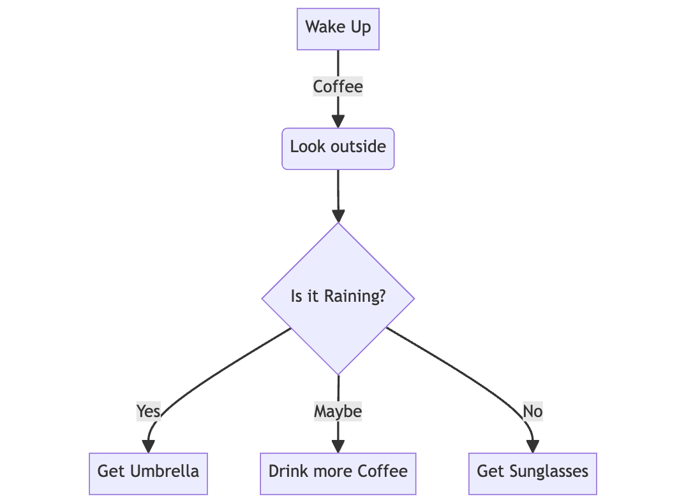
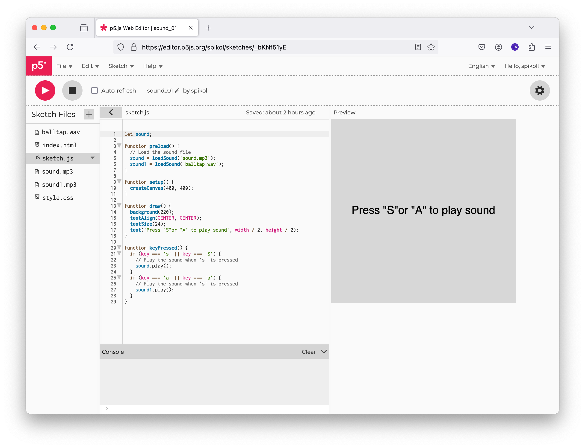

# Kickstart-kursus i programmering 23 dag 3
**Daniel Spikol**  
*ds@di.ku.dk*

**DIKU \\ Københavns Universitet**  
**16. august 2023**


---

# Recap from Tuesday
- Python and Functions
- Animations
- Pair Programming
- Mouse and Key Input

---

# Wednesday IFOs
- Variable Scoping
- Draw() function
- Conditionals
- Sounds
- Ideation

---

# Variable Scoping Py.Processing
- The principles of variable scoping in Processing.py largely follow those of Python but with some considerations given the environment of Processing's draw loop and function setup.
- Scoping in programming refers to the region or portion of the code where a variable or function is defined and can be accessed or modified.
- The concept of scoping is crucial for understanding variable lifetimes, visibility, and potential naming conflicts in your programs. It helps manage and organize data and functionality, enabling modular and maintainable code designs.

---

# Variable Scoping Py.Processing
## Global Variables
**Global Variables**: Variables declared outside of any function are global to the sketch. They can be accessed and modified from any function, but if you want to modify them inside a function, you must declare them as `global` within that function.

```java
var globalVarX = 50;

function setup() {
  createCanvas(400, 400);
}

function draw() {
  background(220);
  fill(255, 0, 0);
  ellipse(globalVarX, 100, 30, 30);
  globalVarX = globalVarX + 1;
}
```

---

# Variable Scoping Py.Processing
## Local Variables
**Local Variables**: Variables declared inside a function are local to that function. They cannot be accessed outside of the function, and their memory is reclaimed once the function execution is complete.

```java
function setup() {
  createCanvas(400, 400);
  var myVar = 42;
  print(myVar); // This prints 42
}

function draw() {
  background(220);
  print(myVar); // This returns error, not defined
}
```

---

# Variable Scoping Py.Processing
**The setup() and draw() Functions**: In Processing.py, `setup()` is called once at the beginning of the sketch, and `draw()` is called repeatedly, producing frames.

```java
var x = 0;

function setup() {
  createCanvas(400, 400);
  var x;
  x = width / 2;
}

function draw() {
  background(220);
  ellipse(x, height / 2, 50, 50);
  x += 1;
}
```

Variables declared in `setup()` are local to `setup()`. Still, often you want to declare global variables at the top level of your sketch and then initialise or modify them in `setup()`.

---

# Conditionals in Computer Science
- Conditionals in computer science refer to constructs that allow for decision-making in code.
- They determine the flow of execution based on whether a given condition is true or false.
- Depending on the outcome of the condition, different blocks of code will be executed.
- Specifically, conditionals perform different computations or actions depending on whether a programmer-defined boolean condition evaluates to true or false.

---

# Conditionals Conceptually
<span style="font-size:25px;">

- **Basic Conditional (IF)**
  - **Concept**: If a specific condition is true, do something.
  - **Example**: "If it's raining, take an umbrella."
- **Alternative Path (ELSE)**
  - **Concept**: If the first condition isn't met, do something else instead.
  - **Example**: "If it's raining, take an umbrella. Otherwise, wear sunglasses."
- **Multiple Conditions (ELSE IF or ELIF)**
  - **Concept**: Check multiple conditions in sequence, and do the first thing that's true.
  - **Example**: "If it's raining, take an umbrella. If it's sunny, wear sunglasses. Otherwise, just go outside as usual."
- **Combining Conditions**
  - **Concept**: You can use logical operators (AND, OR, NOT) to combine conditions.
  - **Example**: "If it's a weekend AND the weather is good, go hiking."
  
</div>

---

# Flowchart Condition



---


# Conditionals
- **If Statement:** Executes a code block if a specified condition is true.
- **Else Statement:** Used in conjunction with an if statement, it specifies a block of code to be executed if the condition in the if statement is false.
- **Else If Statement:** Used to specify a new condition to test if the first condition is false.
- **Switch or Case Statement:** Allows a variable to be tested for equality against a list of values.

---

# Conditionals in p5.js
Python supports the usual logical conditions from mathematics:
- Equals: `a == b` (check what `===` does)
- Not Equals: `a != b`
- Less than: `a < b`
- Less than or equal to: `a <= b`
- Greater than: `a > b`
- Greater than or equal to: `a >= b`

---

# Conditionals in p5.js I
## if:
```java
if (x > 10){
    print("x is greater than 10")
}
```
## else:
```java
if (x > 10) {
    print("x is greater than 10");
  } else {
    print("x is 10 or less");
  }
```
---
## Conditionals in p5.js II

## else if:
```java
x = 13;
  if (x > 10) {
    print("x is greater than 10");
  } else if (x == 10) {
    print("x is 10 or less");
  }
```
You can also combine conditions using logical operators (`and, or, not`):
```java
if (x > 10 && y<5){
    print("x is greater than 10");
  }
```

---

# Conditionals in p5.js
For instance, to animate a circle moving across the screen and to make it wrap around when it reaches the edge:
```java
var x_pos = 0; //set the x postion

function setup() {
  createCanvas(400, 400);
}

function draw() {
  background(220);
  ellipse(x_pos, height / 2, 50, 50);
  x_pos += 2;
  if (x_pos > 400) {
    x_pos = 0; // resets x position
  }
}
```
---

# Sound in p5.js
- Let's keep it simple, but if interested explore the p5 reference
- We are going to load and play sounds, plenty other ways to work with sound.
- SoundFile object with a path to a file.
- The p5.SoundFile may not be available immediately because it loads the file information asynchronously.
- To do something with the sound as soon as it loads pass the name of a function as the second parameter.
- Only one file path is required. However, audio file formats (i.e. mp3, ogg, wav and m4a/aac) are not supported by all web browsers.

---
<style scoped>
  .top-title h1 {
    position: absolute;
    top: 0;
    width: 100%;
    text-align: center;
    font-size: 2em;
    margin: 0;
  }
</style>

<!-- Slide with a custom title style -->
<div class="top-title">

# p5 sound demo



</div>

---
# Code
```java
function preload() {
  // Load the sound file
  sound = loadSound('sound.mp3');
  sound1 = loadSound('balltap.wav');
}

function setup() {
  createCanvas(400, 400);
}

function draw() {
  background(220);
  textAlign(CENTER, CENTER);
  textSize(24);
  text('Press "S"or "A" to play sound', width / 2, height / 2);
}

function keyPressed() {
  if (key === 's' || key === 'S') {
    // Play the sound when 's' is pressed
    sound.play();
  }
  if (key === 'a' || key === 'a') {
    // Play the sound when 's' is pressed
    sound1.play();
  }
}
```