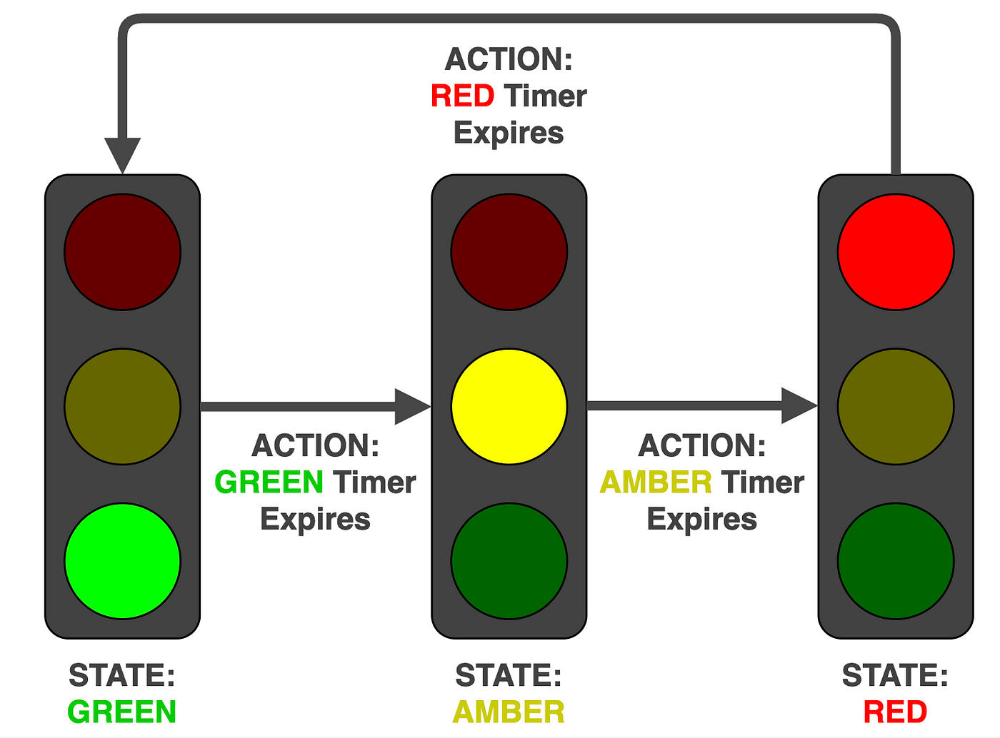
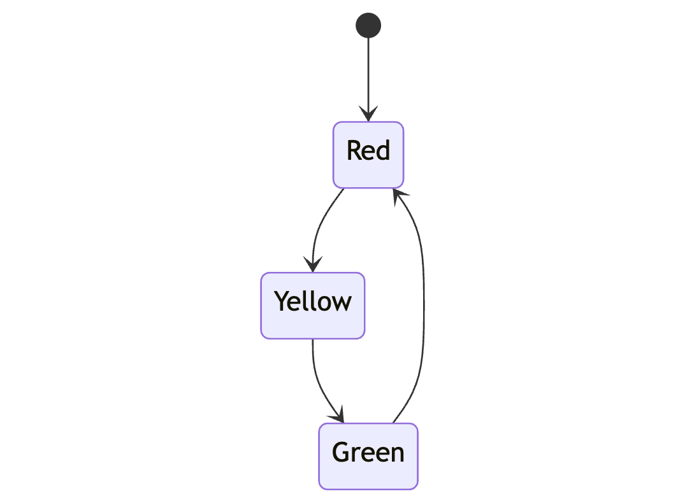

# Kickstart-kursus i programmering 23 dag 4
**Daniel Spikol**  
*ds@di.ku.dk*

**DIKU \\ Københavns Universitet**  
**17. august 2023**

---

# Recap from Wednesday
- Scoping
- Conditionals
- Sounds
- Projects

---

# Thursday IFOs
- Finite State Machines
- Wrapping up Things
- Projects and Demos

---

# Finite State Machines- FSM

- A Finite State Machine (FSM) is a mathematical model of computation used to design algorithms.
- In the context of computer games, FSMs are often used for character behaviour, where different states might represent actions like "idle", "attack", "defend", or "flee", and game events or conditions determine transitions between states.

---

# The STATES in a FSM
- **Discrete States:** An FSM consists of a limited or finite number of states. It can be in just one of these states at any given moment. Transitions define how it changes from one state to another based on inputs or conditions.
- **Transitions & Triggers:** Events or conditions trigger transitions between states. Each state specifies which state the machine will move to next for each possible input.
- **Start and End States:** Among the finite states, there is one initial state where the FSM begins its operation. Additionally, there can be one or more end states where the FSM is considered to be completed or final.

---
<style scoped>
  .top-title h1 {
    position: absolute;
    top: 0;
    width: 100%;
    text-align: center;
    font-size: 2em;
    margin: 0;
  }
</style>

<!-- Slide with a custom title style -->
<div class="top-title">

# The Classic Example



</div>

---
<style scoped>
  .top-title h1 {
    position: absolute;
    top: 0;
    width: 100%;
    text-align: center;
    font-size: 2em;
    margin: 0;
  }
</style>

<!-- Slide with a custom title style -->
<div class="top-title">

# State Diagram


</div>

---
# Mathematical Abstraction of the FSM
- A finite state machine is a mathematical abstraction used to design algorithms. In simple terms, a state machine will read a series of inputs.

- When it reads an input, it will switch to a different state. Each state specifies which state to switch to for a given input.- 

---
<style scoped>
  .top-title h1 {
    position: absolute;
    top: 0;
    width: 100%;
    text-align: center;
    font-size: 2em;
    margin: 0;
  }
</style>

<!-- Slide with a custom title style -->
<div class="top-title">

# Game States


</div>

---
<style scoped>
  .top-title h1 {
    position: absolute;
    top: 0;
    width: 100%;
    text-align: center;
    font-size: 2em;
    margin: 0;
  }
</style>

<!-- Slide with a custom title style -->
<div class="top-title">

# Mario States


</div>

---
<style scoped>
  .top-title h1 {
    position: absolute;
    top: 0;
    width: 100%;
    text-align: center;
    font-size: 2em;
    margin: 0;
  }
</style>

<!-- Slide with a custom title style -->
<div class="top-title">

 # FSM Code Example

```java
//global vars
var state_on = "ON";
var state_off = "OFF";

//initial state
current_state = state_off;

function setup() {
  createCanvas(400, 400);
}

function draw() {
  background(220);

  if (current_state == state_on) {
    fill(0, 255, 0); // green is for on
  } else if (current_state == state_off) {
    fill(255, 0, 0); // red is for off
  }
  ellipse(width / 2, height / 2, 100, 100);
}

function mousePressed() {
  if (current_state == state_off) {
    current_state = state_on;
  } else if (current_state == state_on) {
    current_state = state_off;
  }
}
```

</div>

 ---
 # How do you add Yellow?

 ---
