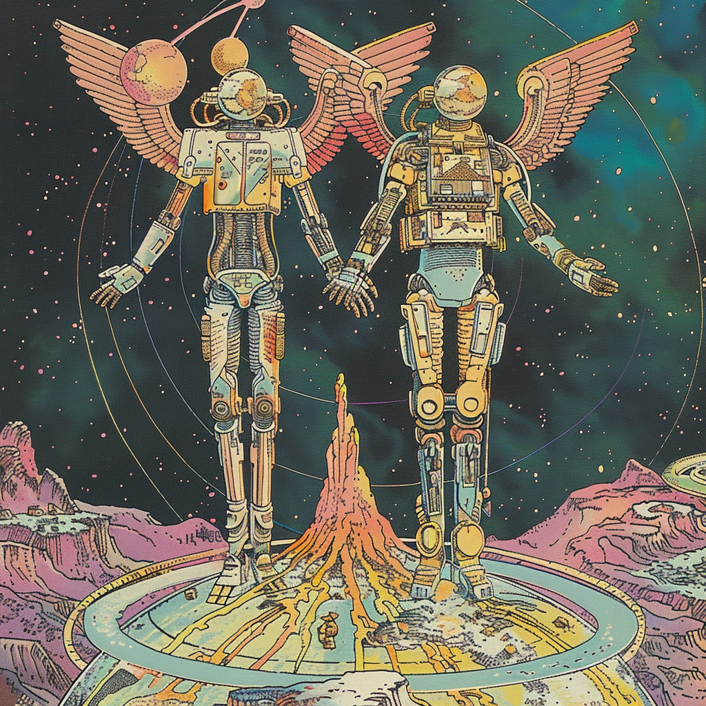
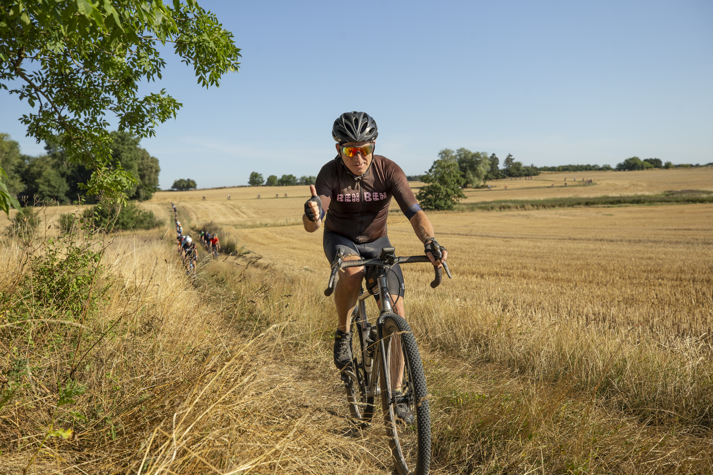

# Kickstart-kursus i programmering 23 dag 5

## Daniel Spikol
### ds@di.ku.dk

## DIKU, Københavns Universitet
### 18. august 2023

---
<!-- _backgroundColor: black -->
# Thanks!<!--fit-->
<!-- _color: pink -->

---

# Recap from Thursday

- Creative Computing
- FSM
- Projects

---

# Today's Plan

- 9.00 - 9.20 Recap
- 9.20 - 9.45 Survey and Thanks!
- 9.45 - 11.45 Project work
- 11.45 - 12.30 Lunch
- 12.30 - 13.00 Final prep
- 13.00 - 13.30 Show and Talk Session 1
- 13.30 - 14.00 Show and Talk Session 1
- 14.00 - 14.30 Show and Talk Session 1
- 14.30 - Thanks!

---

# Friday's IFOs

- Please give us some feedback
- Package up your stuff for show and tell
- Show and Talk

---
# SURVEY!
- Please take 5 minutes

---
<!-- _color: white -->
# Thanks! Remember Grit<!--fit -->

---

# Show and Talk: Sessions
Session 1: Alpha with Beta, Charlie with Delta
Session 2: Alpha with Charlie, Beta with Delta
Session 3: Alpha with Delta, Beta with Charlie
Session 4: Charlie with Alpha, Delta with Beta
