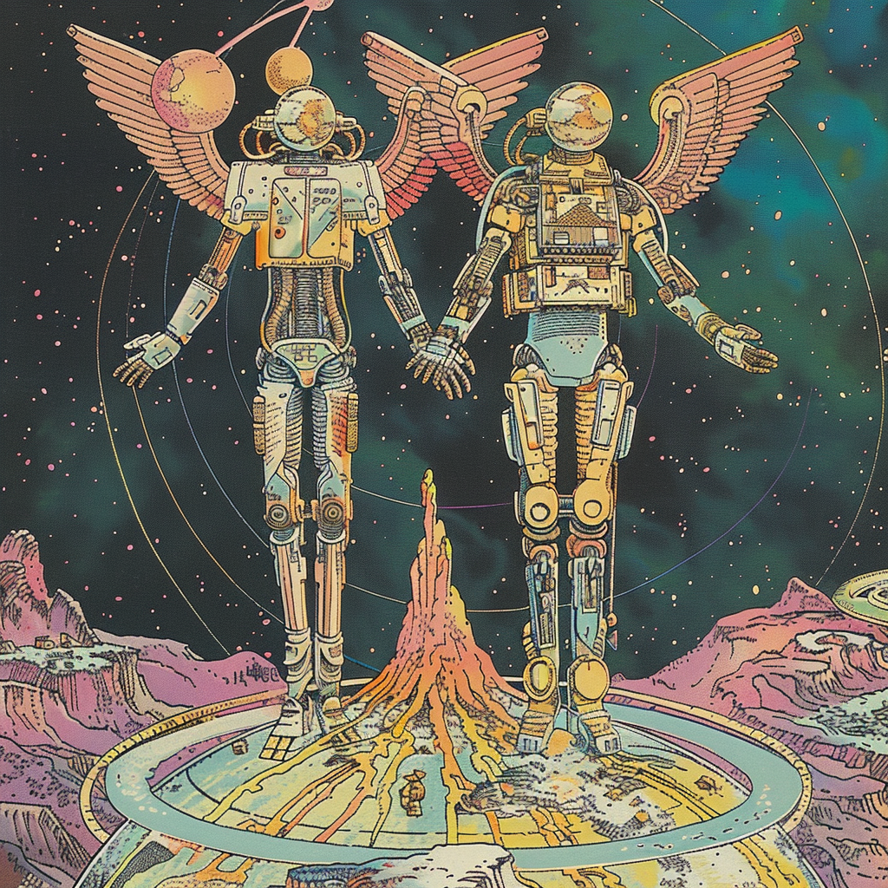
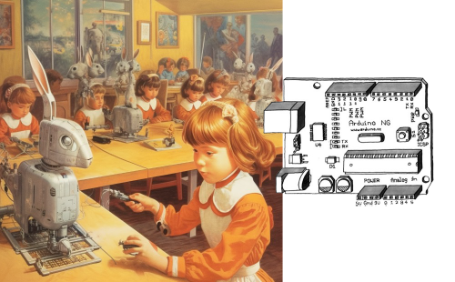
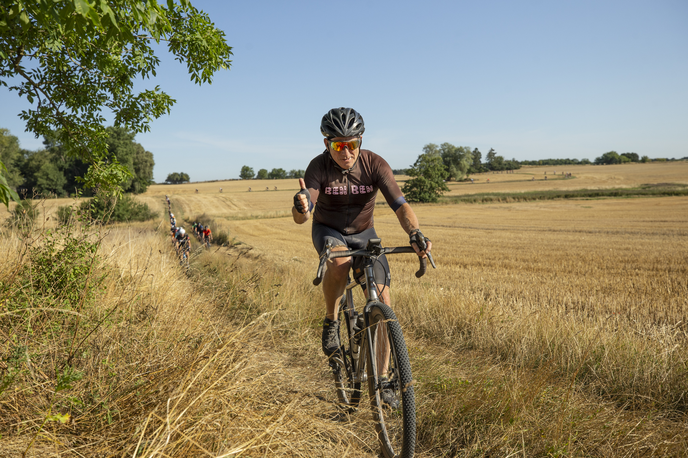

<!-- _backgroundColor: black -->
# Thanks!<!--fit-->
<!-- _color: pink -->

---
# Kickstart-kursus i programmering 23 dag 5

## Daniel Spikol
### ds@di.ku.dk

## DIKU, Københavns Universitet
### 16. august 2023

---

# Recap from Thursday

- Creative Computing
- FSM
- Projects

---

# Today's Plan

- 9.00 - 9.15 Recap
- 9.20 - 9.30 Survey and Thanks!
- 9.30 - 11.45 Project work
- 11.45 - 12.30 Lunch
- 12.30 - 13.00 Final prep
- 13.00 - 13.30 Show and Talk Session Alpha
- 13.30 - 14.00 Show and Talk Session Bravo
- 14.00 - 14.30 Show and Talk Session Charlie
- 14.30 - Thanks!

---

# Friday's IFOs

- Please give us some feedback
- Package up your stuff for show and tell
- Show and Talk

---
# Hackathon

- Sign up via StudieStart
- August 28th 0900 - 1600

---
# DIKU things

1. HCC Open house October 30th Course info, research assistants
2. DIKU Bits - find out about research
3. Mentors, TAs, Research Opportunitites
4. Study Abroad or up the road at DTU and ITU
5. Summer schools and AI Pioneer Center

---
# Poll: Show and Talk

- 10:30 to 12:00 (end earlier)
- 13:30 to 14:30 (end early)
---
# SURVEY!
- Please take 5 minutes
- Absalon!

---

# Show and Talk: Sessions

### Round 1 KL 13.00 - 13:30
- **Host Group:** Alpha
  - **Visitors:** Bravo and Charlie

### Round 2 KL 13.30 - 14.00
- **Host Group:** Bravo
  - **Visitors:** Alpha and Charlie

### Round 3 14:00 - 14:30
- **Host Group:** Charlie
  - **Visitors:** Alpha and Bravo

---
<!-- _color: white -->
# Thanks! Remember Grit<!--fit -->

